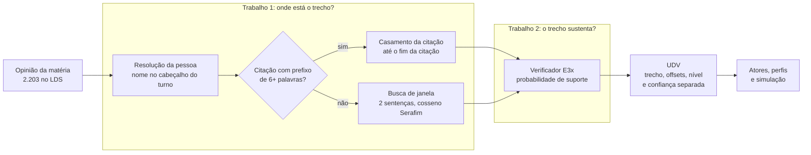

# bookworm

[](LICENSE)
[](https://www.python.org/downloads/release/python-3120/)

**Para cada opinião que uma matéria jornalística atribui a um participante de audiência pública, o
bookworm aponta o trecho da transcrição em que a própria pessoa a disse, com a posição exata, o critério
que escolheu o trecho e, num campo separado, a confiança de que o trecho sustenta a opinião.**



Uma audiência da Câmara dos Deputados tem, em média, 18.102 palavras de transcrição; a matéria que a
cobre tem 627 e não diz em que ponto da fala cada opinião foi dita. Cada ligação que o bookworm grava é
uma **UDV (Unidade Deliberativa Verificável)**, construída sobre o dataset
[PublicHearingBR](https://huggingface.co/datasets/unicamp-dl/PublicHearingBR) para o desafio Ideias em
Rede, 1ª edição (Instituto Kunumi).

**Dois trabalhos, dois métodos.** Achar o trecho é um problema de ordenação, e nenhum dos rivais testados
superou com significância o cosseno do encoder Serafim. Dizer quanto confiar no trecho é um problema de separação, e ali
o cosseno separa pouco: quem dá a confiança é um verificador treinado para essa pergunta. A
probabilidade do verificador estima se o trecho sustenta a opinião; ela não é a probabilidade de a
opinião ser verdadeira, e não muda o nível da UDV. O que cada experimento decidiu está em
[`docs/pipeline.md`](docs/pipeline.md).

## Resultados

Números do [resumo executivo do relatório](docs/report.md#resumo-executivo), onde cada um tem o arquivo
de origem. Intervalos de 95%: bootstrap por audiência na recuperação e no verificador, Wilson na
validação humana.

| achado | número | seção |
|---|---|---|
| Opiniões com evidência localizada (`udv_v2`) | 2.105 de 2.203; 90 de pessoas não resolvidas, 8 sem unidade candidata | [3.5](docs/report.md#35-udv_v2-janelas-citação-inteira-e-verificador) |
| Citações literais localizadas (`quote_found`) | 277 | [3.5](docs/report.md#35-udv_v2-janelas-citação-inteira-e-verificador) |
| Recuperação no benchmark NLI (validação, `serafim_335m`) | acc@1 0,8774, MRR 0,9295; nenhum dos 15 recuperadores alternativos o supera depois de Holm | [4.3](docs/report.md#43-e1-comparação-de-recuperadores-retrieval_v1) |
| Janela de 2 sentenças contra sentença | lift +0,0143 [-0,0091; 0,0409], Holm 0,4104 | [4.4](docs/report.md#44-e2-comparação-de-unidades-retrieval_v1) |
| Laya como reranqueador do top 20 (negativo) | MRR 0,8690 contra 0,9295, Holm 0,0004 | [4.5](docs/report.md#45-retrieval_v2-laya-como-reranqueador-resultado-negativo) |
| Sinais derivados do cosseno como confiança (E5) | nenhum IC de diferença de AURC exclui zero | [5.5](docs/report.md#55-e5-sinais-de-confiança-derivados-do-recuperador-confidence_v1) |
| Verificador contra cosseno, validação | ROC AUC 0,8758 contra 0,7302, Δ +0,1457 [0,0852; 0,2159], Holm 0,012 | [5.6](docs/report.md#56-confidence_v2-e-a-o-verificador-contra-avaliadores-da-literatura) |
| Verificador, teste final (559 opiniões) | ROC AUC 0,9122 [0,8698; 0,9454], kappa 0,5924 | [5.3](docs/report.md#53-e3x-verificador-aprendido) |
| Verificador sobre as 2.105 evidências de `udv_v2` | passam 1.750 (0,8314) no corte de premissa UDV 0,2429; 826 (0,3924) no corte do benchmark 0,7478 | [3.5](docs/report.md#35-udv_v2-janelas-citação-inteira-e-verificador) |
| Validação humana, `quote_found`, precisão estrita | 25 de 35, 0,7143 [0,5495; 0,8367]; **critério (limite inferior ≥ 0,90) falha** | [7.2](docs/report.md#72-resultado-final-de-udv_v1) |
| Validação humana, `semantic_match_high` de `udv_v1`, tolerante | 48 de 65, 0,7385 [0,6205; 0,8298]; **critério (limite inferior ≥ 0,75) falha** | [7.2](docs/report.md#72-resultado-final-de-udv_v1) |
| Validação humana, `semantic_match_high` de `udv_v2`, tolerante | 52 de 63, 0,8254 [0,7138; 0,8996], com herança de rótulo; **critério falha** | [7.4](docs/report.md#74-resultado-final-de-udv_v2) |
| Simulação de atores a partir do perfil, teste (101 perguntas, acaso 0,25, rodada sobre `udv_v1`) | acerto 0,4257 com perfil contra 0,3069 só com nome e cargo, +0,1188 [0,0495; 0,1965]; acrescentar trechos muda +0,0198 [-0,0286; 0,0702] | [6.3](docs/report.md#63-perfis-de-ator-e-simulação) |

> [!WARNING]
> **Os dois critérios da validação humana, declarados antes da anotação, falharam.** Na citação literal,
> o trecho é `correta` ou `parcial` em 31 de 35 casos, mas `correta` em só 25, e o critério pedia 35 de
> 35. No `semantic_match_high`, de `udv_v1` para `udv_v2` a precisão tolerante subiu de 0,7385 para
> 0,8254, mas o limite inferior (0,7138) ficou abaixo de 0,75: passar exigiria 54 acertos em 63, e houve
> 52. Os números de `udv_v2` supõem que 78 itens cuja evidência nova contém o trecho antigo herdam o
> rótulo de `udv_v1`, premissa não medida. Há um anotador, e nem a revocação da busca nem a
> concordância intra-anotador são estimáveis ([relatório, seção 10](docs/report.md#10-limitações)).

## Rode em 3 comandos

Requer Python 3.12 e [uv](https://docs.astral.sh/uv/). Roda em CPU, sem modelo, e confere a rodada
publicada `udv_v2` recalculando cada UDV a partir do dataset (cerca de 25 s depois do download).

```bash
git clone https://github.com/santana-ai/bookworm.git && cd bookworm/experiments
uv sync && uv run python -m experiments.data.download
uv run bookworm verify-udvs --config configs/udv_v2.toml --run-name udv_v2
```

O último comando termina com `"problems": {}`. Um exemplo que constrói UDVs com TF-IDF em segundos está
no [README da biblioteca](bookworm/README.md#início-rápido-em-cpu); as 25 etapas de todos os
experimentos, no [guia de reprodução](docs/reproduce.md).

## O que está no repositório

| caminho | o que é |
|---|---|
| [`bookworm/`](bookworm/README.md) | a biblioteca Python e a CLI `bookworm`: UDVs, splits temporais, falas e perfis de atores, exportação da demo |
| [`bookworm/web/`](bookworm/web/README.md) | a demo web: opinião, trecho escolhido, candidatas, cosseno e verificador, e uma página por ator |
| [`experiments/`](experiments/README.md) | os experimentos: scripts, configurações, artefatos versionados e notebooks |
| [`docs/`](docs/README.md) | relatório, pipeline, metodologia, validação, reprodução e visão; o índice diz a ordem de leitura |
| [`CONTRIBUTING.md`](CONTRIBUTING.md) | ambiente, verificações e convenções |
| [`CITATION.cff`](CITATION.cff), [`LICENSE`](LICENSE) | como citar e licença |

O artigo do desafio fica num repositório próprio:
[github.com/JoaoVitorBoer/bookworm](https://github.com/JoaoVitorBoer/bookworm).

## Três leituras de uma audiência

O dataset mistura três leituras parciais, e o projeto não as confunde:

- **Documental:** o que a transcrição sustenta. É o que a UDV tenta ancorar.
- **Editorial:** o que a matéria selecionou e redigiu. As 2.203 opiniões do arquivo LDS são essa leitura.
- **Anotada sob recuperação:** o rótulo do arquivo NLI (`retrieved_context_entailment`) diz se um
  especialista achou a opinião inferível de quatro trechos recuperados, não se ela é verdadeira nem se
  está na transcrição inteira.

A tese completa está em [`docs/vision.md`](docs/vision.md).

## Integridade científica

- **O teste não escolhe nada.** Splits temporais (144 audiências de treino, 32 de validação, 30 de
  teste); cortes, métodos e hiperparâmetros saem do treino e da validação, e todo comando que lê o teste
  exige `--final-test`.
- **Um rótulo NLI não é verdade global**, e a probabilidade do verificador não é a probabilidade de a
  opinião ser verdadeira.
- **Ausência não é erro da matéria.** Uma opinião sem evidência é uma opinião para a qual o método não
  achou trecho; nada é chamado de alucinação por isso.
- **Nenhuma inferência de intenção política** de participantes, jornalistas ou veículos.
- **Resultados negativos e parciais ficam como são**, e as decisões tomadas depois de ver resultados
  estão registradas nas configurações e no relatório.
- **Tudo é rastreável.** Dataset e modelos em revisões fixadas, sementes declaradas, e cada relatório JSON
  grava o sha256 do código, das entradas e da configuração ([reprodução](docs/reproduce.md)).

## Licença e citação

O código é MIT ([`LICENSE`](LICENSE)). Os dados do PublicHearingBR, e os trechos de transcrição e de
matéria reproduzidos nos artefatos, seguem os termos do próprio dataset. Os modelos de terceiros têm
licenças próprias ([relatório, seção 11.2](docs/report.md#112-modelos-usados)); o tradutor
`facebook/nllb-200-distilled-600M` é CC-BY-NC-4.0, e as traduções derivadas dele ficam sujeitas a essa
restrição; o `ruanchaves/mdeberta-v3-base-assin2-entailment` não declara licença no Hugging Face.

Os metadados de citação estão em [`CITATION.cff`](CITATION.cff). Ao usar os dados, cite também o artigo
do dataset:

```bibtex
@misc{fernandes2024publichearingbr,
  title         = {PublicHearingBR: A Brazilian Portuguese Dataset of Public Hearing Transcripts for Summarization of Long Documents},
  author        = {Leandro Carísio Fernandes and Guilherme Zeferino Rodrigues Dobins and Roberto Lotufo and Jayr Alencar Pereira},
  year          = {2024},
  eprint        = {2410.07495},
  archivePrefix = {arXiv},
  primaryClass  = {cs.CL},
  url           = {https://arxiv.org/abs/2410.07495}
}
```

**Equipe:** Arthur Germano, João Vitor Boer Abitante, Henrique Santana.
